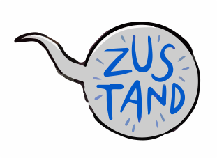
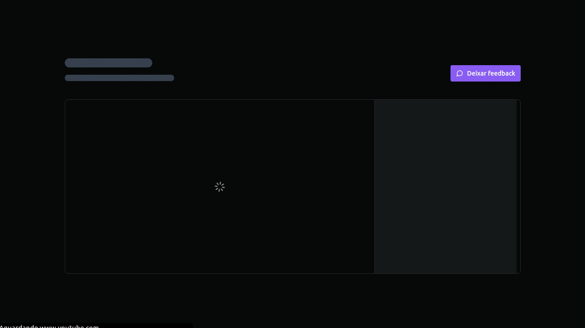

  
  
  
  
  
  
	
  
  
  

  

# Redux Zustand

## ✒️ Descrição
Nesta aplicação, foi desenvolvido um player de vídeo utilizando tecnologias como React, JSON Server, Tailwind CSS e, posteriormente, o Zustand, que substituiu o Redux para um gerenciamento de estado mais simples, com o objetivo de simplificar a aplicação. Este projeto foi uma oportunidade de aprendizado em relação ao gerenciamento de estados. Suas principais funcionalidades incluem reproduzir vídeos, avançar automaticamente e pular para o próximo módulo.

## 🚀 Tecnologias utilizadas

 
  
  
  

  
	
  
  
   

   

   

## 📷 Demostração

  

## 🔥 Instalação
Clone o repositório.
~~~
git clone https://github.com/vian4dev/redux-zustand.git
~~~
Acesse o diretório do projeto.
~~~
cd redux-zustand/
~~~
Instale as dependências.
~~~
npm install
~~~
Execute o servidor.
~~~
npm run server
~~~
Execute a aplicação.
~~~
npm run dev
~~~

## 📝 Licença
Esse projeto está sob a licença MIT. Veja o arquivo [LICENSE](LICENSE) para mais detalhes.

---

 
 
Desenvolvido por - <a href="https://github.com/vian4dev">Gabriel Viana</a> 🤖

 
  

